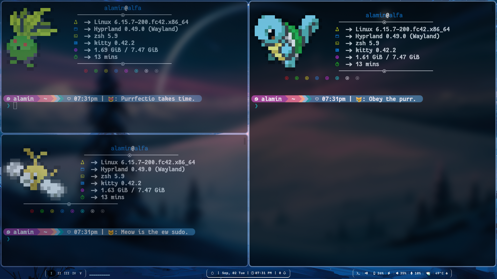
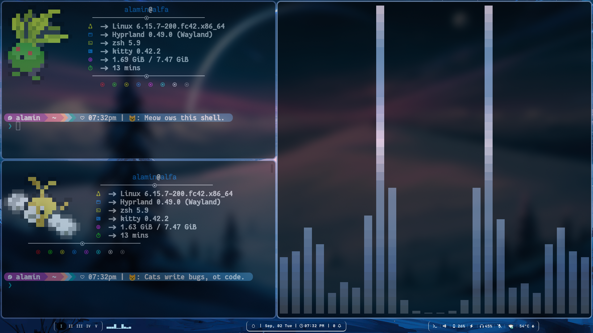
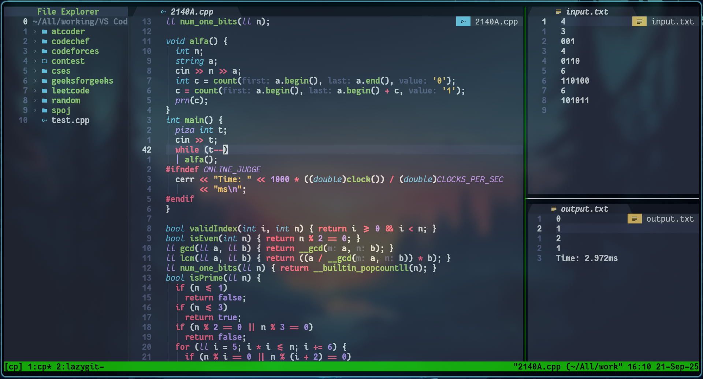
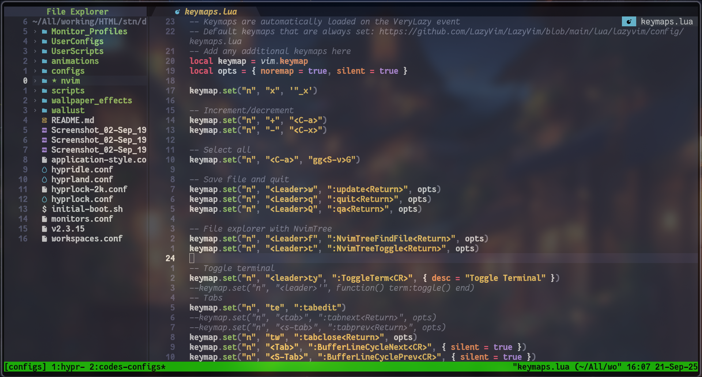

# My Hyprland Dotfiles

A comprehensive collection of configuration files and scripts to set up and customize a Hyprland Wayland compositor environment. This setup includes window management, keybindings, theming, wallpapers, and various automation scripts for an enhanced desktop experience.

## Screenshots

Also I like minimal and clean setups for waybar/taskbar.

### Neovim + Tmux Setup (My Coding Environment/IDE)

## Features

### Core Functionality
- **Window Management**: Support for Dwindle and Master layouts, floating windows, fullscreen modes, and workspace management.
- **Input Configuration**: Keyboard layouts, mouse sensitivity, touchpad settings, and gesture support for workspace swiping.
- **Display Settings**: Monitor configurations, VRR, and scaling options.

### Keybindings
- Extensive keybinds for launching applications (terminal, file manager, browser).
- Media controls (volume, brightness, microphone toggle).
- System utilities (refresh, emoji picker, search, clipboard manager).
- Window controls (fullscreen, floating, layout toggle).
- Custom scripts for wallpapers, themes, and animations.

### Scripts and Automation
- **Initial Boot Script**: Sets up wallpapers, GTK themes, icons, cursors, and Kvantum themes on first run.
- **Wallpaper Management**: Select wallpapers, apply effects, random wallpapers using swww and imagemagick.
- **Theme Switching**: Change GTK, icon, cursor themes, and Waybar styles.
- **Refresh Script**: Restart Waybar, Rofi, SwayNC, and other components.
- **Utility Scripts**: Volume control, brightness, airplane mode, game mode, etc.
- **User Scripts**: Custom scripts for music, calculator, weather, Pokemon color script, etc.

### Theming and Appearance
- **Animations**: Multiple animation styles (default, minimal, optimized, etc.).
- **Decorations**: Window borders, shadows, blur effects.
- **Waybar**: Customizable status bar with multiple styles and layouts.
- **Rofi**: Application launcher with theme selector.
- **GTK/QT Integration**: Automatic theme application for GTK and Qt applications.

### Hardware Support
- **Laptop Configurations**: Specific settings for battery, touchpad, and display.
- **Multi-Monitor**: Profiles for different monitor setups.
- **NixOS Compatibility**: Adjusted settings for NixOS systems.

### Development Environment
- **Neovim Configuration**: LazyVim-based setup with modern plugins and configurations.
- **Tmux Integration**: Terminal multiplexer with mouse support, vi mode keys, and plugin management via TPM (Tmux Plugin Manager).
- **Terminal Support**: Optimized for Kitty terminal with RGB color support.

## Installation

1. **Prerequisites**: Ensure Hyprland and required dependencies are installed (swww, wallust, waybar, rofi, swaync, etc.).
2. **Clone the Repository**: Place these dotfiles in `~/.config/hypr/`.
3. **Initial Setup**: Run `initial-boot.sh` to apply initial themes and wallpapers.
4. **Configuration**: The main `hyprland.conf` sources various config files. Customize as needed in `UserConfigs/`.

## Usage

- **Launching Apps**: Use SUPER + D for the application launcher.
- **Customization**: Edit files in `UserConfigs/` for personal settings (keybinds, settings, decorations).
- **Scripts**: Execute scripts from `scripts/` or `UserScripts/` for various functions.
- **Themes**: Use provided scripts to switch themes and wallpapers.

## Keybinds Overview

### Application Launchers
- `SUPER + D`: Main application menu (Rofi)
- `SUPER + Return`: Terminal
- `SUPER + E`: File manager
- `SUPER + B`: Default browser

### System Controls
- `SUPER ALT + R`: Refresh Waybar, Rofi, SwayNC
- `SUPER + H`: Key hints/cheat sheet
- `SUPER ALT + M`: Toggle microphone
- `SUPER SHIFT + G`: Game mode (toggle animations)

### Window Management
- `SUPER + SPACE`: Toggle floating
- `SUPER SHIFT + F`: Fullscreen
- `SUPER CTRL + F`: Fake fullscreen
- `SUPER ALT + L`: Toggle layout (Dwindle/Master)

### Media and Utilities
- `SUPER ALT + E`: Emoji picker
- `SUPER + S`: Web search
- `SUPER ALT + V`: Clipboard manager
- `SUPER + W`: Wallpaper selector
- `SUPER SHIFT + W`: Wallpaper effects

### Waybar Controls
- `SUPER CTRL + B`: Waybar styles menu
- `SUPER ALT + B`: Waybar layout menu
- `SUPER CTRL ALT + B`: Toggle hide/show Waybar

*Add your desktop demo images here to showcase the setup.*

## File Structure

- `hyprland.conf`: Main configuration file
- `UserConfigs/`: User-customizable settings (keybinds, decorations, animations, etc.)
- `scripts/`: System scripts for various functions
- `UserScripts/`: Custom user scripts
- `animations/`: Different animation configurations
- `configs/`: Default configurations
- `wallpaper_effects/`: Wallpaper-related files
- `wallust/`: Color scheme configurations
- `nvim/`: Neovim configuration with LazyVim setup
- `tmux/`: Tmux configuration with plugin management

## Credits

This dotfiles setup is based on [JaKooLit's Hyprland Dots](https://github.com/JaKooLit). Special thanks to the Hyprland community and contributors.

